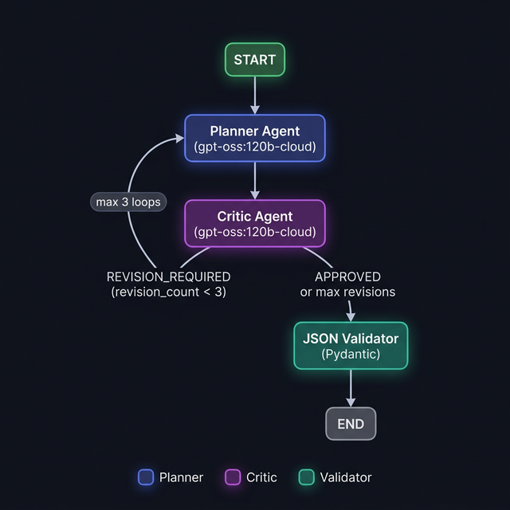

# 🔐 TrustVault — AI Milestone Contract Generator

A **production-ready LangGraph multi-agent pipeline** that converts a plain-English project description into a fully structured, verifiable milestone contract — ready to populate a freelance escrow contract UI.

Built with **LangGraph**, **LangChain**, **Ollama** (`gpt-oss:120b-cloud`), and an interactive **Gradio** frontend.

---

## ✨ Features

- 🧠 **Planner Agent** — Decomposes any project description into logical, sequenced milestones with verifiable deliverables and measurable acceptance criteria
- 🔍 **Critic Agent** — Audits the plan for vague deliverables, poor sequencing, and unrealistic scope
- 🔁 **Revision Loop** — Automatically feeds critic feedback back to the planner (up to 3 iterations) before producing final output
- ✅ **JSON Validator** — Validates the final output against a strict Pydantic schema before returning
- 🖥️ **Gradio UI** — Clean, interactive web interface for testing and demo
- 🧪 **8 Offline Unit Tests** — Test schema, routing, and validation logic without needing Ollama running

---

## 🗂️ Project Structure

```
planner_agent/
├── .venv/                  # Python 3.10 virtual environment
├── requirements.txt        # All dependencies
│
├── schema.py               # PlannerState (TypedDict) + MilestoneOutput (Pydantic)
├── prompt.py               # Planner & Critic system prompts
├── planner_agent.py        # Planner LangGraph node
├── critic_agent.py         # Critic node + route_critic() conditional router
├── validator.py            # Pydantic validation node
├── graph.py                # LangGraph StateGraph — wires all nodes + edges
│
├── main.py                 # CLI entry point
├── app.py                  # Gradio interactive UI
├── test_graph.py           # Offline unit tests (no Ollama required)
└── README.md
```

---

## 🏗️ Architecture

### Graph Topology



| Node | Role |
|------|------|
| **Planner Agent** | Calls Ollama with the project prompt; returns structured milestone JSON |
| **Critic Agent** | Audits the plan; returns `APPROVED` or `REVISION_REQUIRED: <feedback>` |
| **route_critic()** | Conditional edge: routes to Validator (approved / max revisions) or back to Planner |
| **JSON Validator** | Validates output against Pydantic `MilestoneOutput` schema; sets `status` |

### State Schema (`PlannerState`)

```python
{
    "project_prompt":  str,   # Original user input
    "planner_output":  dict,  # Latest milestone plan from Planner
    "critic_feedback": str,   # Latest feedback from Critic
    "revision_count":  int,   # Number of revision loops used (max 3)
    "final_output":    dict,  # Validated final output
    "status":          str,   # "planning" | "reviewing" | "done" | "error"
}
```

---

## 📦 Output JSON Schema

```json
{
  "project_analysis": {
    "project_type": "web_application",
    "complexity": "low | medium | high",
    "estimated_total_days": 20
  },
  "milestones": [
    {
      "id": 1,
      "objective": "UX Research & Wireframing",
      "description": "Create user flow diagrams and low-fidelity wireframes.",
      "deliverables": [
        "User Journey Map PDF",
        "Low-fi Figma Wireframes Link"
      ],
      "acceptance_criteria": [
        "Includes guest and registered checkout flows",
        "Figma link accessible and commented"
      ],
      "estimated_days": 5,
      "amount_percentage": 30
    }
  ]
}
```

> **Note:** `deadline` is calculated by the backend from `estimated_days`. `amount` is computed from `amount_percentage` × total contract value.

---

## ⚙️ Prerequisites

### 1. Python 3.10

```bash
# Using pyenv (recommended)
pyenv install 3.10.13
pyenv local 3.10.13
```

### 2. Ollama with `gpt-oss:120b-cloud`

```bash
# Install Ollama: https://ollama.com
ollama pull gpt-oss:120b-cloud
ollama serve   # start if not already running
```

---

## 🚀 Setup & Installation

```bash
# 1. Navigate to project directory
cd planner_agent

# 2. Create virtual environment
python3.10 -m venv .venv
source .venv/bin/activate

# 3. Install dependencies
pip install -r requirements.txt
```

---

## 🖥️ Usage

### Option 1 — Gradio Web UI (Recommended)

```bash
source .venv/bin/activate
python app.py
```

Open the printed URL (e.g. `http://.0.0.0:7861`) in your browser.

- Paste a project description into the text box
- Click **⚡ Generate Milestone Plan**
- View the formatted milestone breakdown and raw JSON output
- Pipeline status shows Critic decision and revision count

### Option 2 — CLI

```bash
source .venv/bin/activate

# Use the built-in example prompt
python main.py

# Or pass your own project description
python main.py --prompt "Build a real-time chat app with WebSockets, React frontend, and message history."
```

---

## 🧪 Running Tests

Unit tests cover schema validation, validator node logic, and critic routing — **no Ollama required**.

```bash
source .venv/bin/activate
python test_graph.py
```

Expected output:

```
test_approved_routes_to_validator ... ok
test_max_revisions_forces_validator ... ok
test_revision_count_increments ... ok
test_revision_required_routes_to_planner ... ok
test_invalid_plan_raises_validation_error ... ok
test_valid_plan_parses_correctly ... ok
test_invalid_plan_sets_status_error ... ok
test_valid_plan_sets_status_done ... ok

Ran 8 tests in 0.001s — OK
```

---

## 📝 Agent Prompt Design

### Planner Agent

The planner is instructed to:
- Produce **only** valid JSON (no markdown fences, no explanation)
- Ensure deliverables are **specific and verifiable** (not "build backend")
- Ensure acceptance criteria are **measurable** (not "looks good")
- Guarantee `amount_percentage` values sum to **exactly 100**
- Use JSON mode (`format="json"`) in ChatOllama for consistent output

### Critic Agent

The critic responds with exactly one of:
- `APPROVED` — plan is production-ready
- `REVISION_REQUIRED: <structured feedback>` — lists specific issues

Critic evaluates:
1. Deliverable specificity & verifiability
2. Measurability of acceptance criteria
3. Logical milestone sequence
4. Balanced scope distribution
5. Full project coverage
6. Percentage sum = 100
7. Realistic time estimates

---

## 🔧 Configuration

| Setting | Location | Default |
|---------|----------|---------|
| Ollama model | `planner_agent.py`, `critic_agent.py` | `gpt-oss:120b-cloud` |
| Max revision loops | `critic_agent.py` | `3` |
| Planner temperature | `planner_agent.py` | `0.3` |
| Critic temperature | `critic_agent.py` | `0.1` |
| Gradio host | `app.py` | `0.0.0.0` (auto port) |

---

## 🗺️ Roadmap / Extensions

- [ ] Streaming output to Gradio UI (token-by-token)
- [ ] Per-milestone deadline calculation from `estimated_days` + project start date
- [ ] PDF contract export from milestone JSON
- [ ] Multi-currency `amount` support (₹ / $ / €)
- [ ] LangSmith tracing integration for observability
- [ ] REST API wrapper (FastAPI) for backend service integration

---

## 📚 Tech Stack

| Library | Version | Purpose |
|---------|---------|---------|
| `langgraph` | ≥ 0.2.0 | Graph orchestration |
| `langchain` | ≥ 0.2.0 | LLM abstraction |
| `langchain-ollama` | ≥ 0.1.0 | Ollama integration |
| `pydantic` | ≥ 2.0.0 | Output schema validation |
| `gradio` | ≥ 6.0.0 | Interactive web UI |

---

## 📄 License

MIT — for TrustVault internal use and extension.
